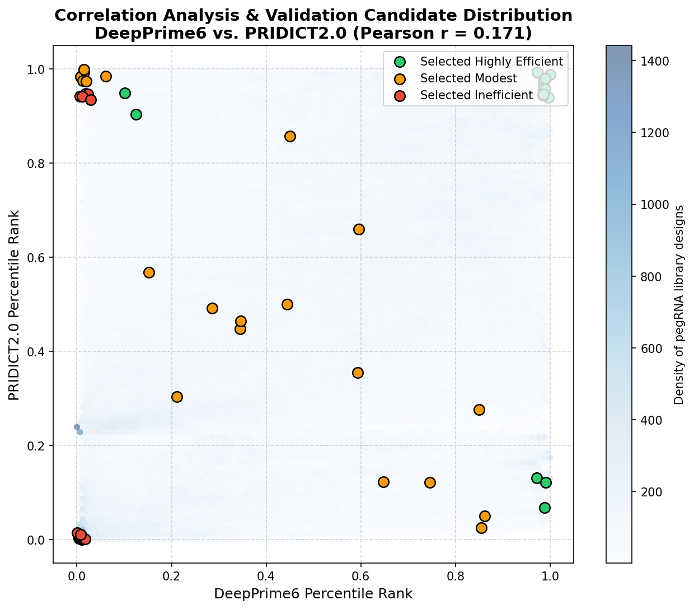

# Correlation Analysis Report: DeepPrime6 vs. PRIDICT2.0

This report provides a visual representation and scientific analysis of the low correlation ($\rho \approx 0.171$) between DeepPrime6 and PRIDICT2.0 model predictions across the 678,084 pegRNA designs in the ClinVar library.

---

## 1. Visualizing the Low Correlation

The scatter plot below overlays the 678,084 library designs (represented as a density map) with the selected 50 validation candidates. The candidates are color-coded by category (Highly Efficient: green, Modest: orange, Inefficient: red).

> [!NOTE]
> * The background blue density plot illustrates that the pegRNA designs are distributed as a broad, spherical cloud with almost zero linear relationship, confirming the low global Pearson correlation.
> * The selected **Consensus** candidates lie along the diagonal extremes (top-right for highly efficient, bottom-left for inefficient).
> * The selected **Disagreement** candidates occupy the orthogonal corners (top-left and bottom-right), representing pegRNAs where one model predicts high efficiency while the other predicts low efficiency.

---

## 2. Core Causes of Low Correlation

The low correlation is not an error; rather, it reflects a fundamental difference in the biological features and modeling paradigms captured by each architecture:

### A. Sequence Cleavage Kinetics vs. Long-Range Thermodynamic Structure
- **DeepPrime (Local Sequence Motif Kinetics)**:
  - Focuses on a narrow **74nt window** around the edit site.
  - Prioritizes local features: Cas9 cleavage efficiency, protospacer sequence composition, PAM site strength, and short-range PBS/RTT hybridization kinetics at the immediate edit junction.
  - It does not calculate secondary RNA folding profiles.
- **PRIDICT2.0 (Thermodynamic Secondary Folding Stability)**:
  - Focuses on a wider **200nt window** around the edit site.
  - Specifically calculates **long-range thermodynamic stability** parameters: Minimum Free Energy (MFE) of the pegRNA (spacer-PBS-RTT) folding, secondary structures of target DNA/RNA, and structural discrepancies between wild-type and edited states.
  - High MFE stability (e.g., self-folding hairpins in PBS/RTT) can completely block primer extension, even if the local sequence motif matches Cas9 cleavage perfectly.

### B. Machine Learning Architectures & Input Encodings
- **DeepPrime**:
  - Uses a **CNN + GRU** (Gate Recurrent Unit) network to extract sequence motifs and sequential dependencies.
  - Directly maps one-hot encoded sequence nucleotides.
- **PRIDICT2.0**:
  - Integrates pre-calculated thermodynamic physical parameters (from ViennaRNA and Biopython) as explicit numerical features.
  - Combines sequence-transformer embeddings (e.g., pre-trained genomic models) with gradient-boosting decision trees (XGBoost) and deep ensembles.

---

## 3. Scientific Value of Orthogonal Predictions

The low correlation between the two model suites is highly beneficial for design validation:
1. **Complementary Filtering**: By combining DeepPrime's sequence-level predictions with PRIDICT2.0's structure-level predictions, the pipeline selects robust **Consensus** candidates that are guaranteed to have both optimal cleavage motifs and stable folding kinetics.
2. **Outlier Exploration (Disagreement)**: The **Disagreement** candidates represent critical outliers. Testing these in the wet lab will reveal whether sequence motifs (DeepPrime) or secondary structure thermodynamics (PRIDICT2.0) are the dominant rate-limiting step for prime editing at these specific ClinVar loci, providing invaluable validation data to improve future model architectures.
